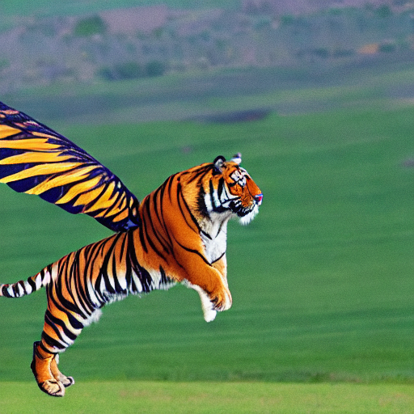

# Speech-to-Image-Generation-Using-Whisper-StableDiffusion

## Overview
This project converts speech/audio input into AI-generated images using **OpenAI Whisper** for speech-to-text transcription and **Stable Diffusion** for text-to-image generation. The goal is to create visual representations of spoken words using deep learning models.

## Technologies Used
- **Whisper** (OpenAI) – Speech-to-text transcription
- **Stable Diffusion v1.5** (runwayml) – Text-to-image generation
- **PyTorch** – Deep learning framework
- **Diffusers** – For running Stable Diffusion
- **Google Colab** (Optional) – For cloud-based execution

## Installation
To set up and run the project locally:

1. **Clone the repository:**
   ```bash
   git clone https://github.com/yourusername/Speech-to-Image-Generation.git
   cd Speech-to-Image-Generation
2. **Install Dependencies:**
    ```bash
    pip install -r requirements.txt

## Usage:
- Upload an audio file: The program processes the uploaded audio and converts it to text using Whisper.
- Generate an image: The transcribed text is used as a prompt for Stable Diffusion to create an image.
- Save & view the output: The generated image is saved as stable_diffusion_generated.png.

## Output:



- Transcription Output: Displayed in the terminal.
- Generated Image: Saved as stable_diffusion_generated.png.

## Future Improvements

- Support for multiple languages in Whisper
- Option to fine-tune image generation settings
- Web interface for easy usage


## License
This project is licensed under the MIT License - see the LICENSE file for details.
